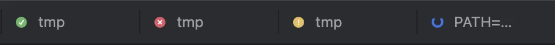

Run five agents in five tabs and the hard part is no longer the typing. It is knowing which one is still working, which one finished ten minutes ago, and which one has been waiting for your “yes” all along. Next Term puts that answer on every tab.

## The marks

| Mark | Meaning |
|---|---|
| none | At the prompt, or a plain command running |
| ◌ spinner | An AI agent is working |
| ✓ green check | An agent stopped and is waiting for your next prompt, or a command finished |
| ! amber | An agent is waiting on your decision (the question is in the tooltip), or a program rang the bell |
| ✕ red cross | A command exited with an error (the exit code is in the tooltip) |

Each mark is a shape as well as a colour, so it reads without colour vision too. A mark clears when you look at the tab. With the terminal folded to its rail beside the editor, no tab is on screen: the tab in front gets its mark, notifications and VoiceOver announcements like any other.

The spinner is reserved for AI agents. It runs while the agent says it is working, or, for an agent whose screen hints are not known yet, while it prints (see [How Next Term knows](#how-next-term-knows)). A build or a test run shows no spinner while it runs; it ends with a check or a cross. A dev server or an editor never shows one at all.

## Decisions come to you

When an agent asks for permission (“Do you want to make this edit to `User.php`?”), or Claude Code asks you to pick one of its options (“Which approach should I take?”), the tab turns amber and a notification names the agent and quotes the question. Click it to land on that tab, in that window. This happens even while you are in Next Term, as long as that tab is not the one on screen.

Answer the question in the terminal as usual; the amber mark clears once the question goes away.

## Notifications and the Dock badge

**Settings › Notifications** chooses which of these reach Notification Center (see [Settings](/docs/settings/#notifications)). By default:

- **A decision** notifies wherever you are, in Next Term or in another app (see above).
- **An agent that finished** notifies the same way: in Next Term too, for a tab you are not looking at. An agent that stopped is “waiting for you”; an agent that exited (`claude -p …`) has “finished”. Its screen has to show it stopped for a second first, so a frame drawn halfway is not taken for the end.
- **A tab another agent drives** over MCP (it opened the tab, or typed into it) is that agent’s to wait for: while you are in Next Term, its agent finishing does not notify you; from another app, it does. Its decisions still notify. Type in the tab yourself and it is yours again. See [Orchestration](/docs/orchestration/#waiting).
- **A command that finished or failed**, such as a build or a test run, notifies only while you are in another app. In Next Term, the tab mark says it already. A failed command says so, with its exit code.
- **Finished work** notifies only when it took at least 5 seconds. Settings can raise that to 30 seconds, 1 minute or 5 minutes. A decision or a bell notifies whatever its length.
- **A bell**, or a program’s own notification (OSC 9 or OSC 777), marks the tab amber: it needs your attention. It notifies while you are in another app.
- **Never the tab on screen:** none comes for the selected tab of the window you are working in, also while that window’s alert, <kbd>⌘P</kbd> or Find in Files has the keyboard. Another window in front, such as Settings, takes it off screen. Folded to its rail, the terminal is not on screen, so the tab in front notifies like any other.
- **Each one names its tab and the window’s project** (or, without one, the tab’s folder). Click it to land on that tab, in that window.
- **Repeats are held back:** each tab replaces its previous notification, and the same message is not repeated within 10 seconds. Several tabs finishing together make one sound, and a window’s notifications stack together in Notification Center.
- **The Dock badge** counts the tabs with a mark you have not seen yet.
- **VoiceOver** announces when a background tab finishes, fails or needs your attention, since the marks themselves are visual.

The tab marks, the Dock badge and VoiceOver’s announcements come whatever Settings › Notifications says: it chooses only the notifications.

Notifications use macOS’s own Notification Center. **Settings › Notifications** says whether macOS allows Next Term’s, and whether it shows them as banners. If you declined them at first launch, or set Next Term’s alert style to None, **Open Notification Settings…** there takes you to Next Term in **System Settings → Notifications**. **Send Test Notification** shows one, when macOS allows them; when it does not, the line above says so.

## How Next Term knows

Next Term uses the most reliable source available, in this order.

### 1. zsh integration

Next Term starts zsh with its own `ZDOTDIR` holding a tiny `.zshenv`. That file points `ZDOTDIR` back at your real configuration, loads your `.zshenv`, and adds `preexec` and `precmd` hooks that report each command (as typed, and with aliases expanded), its exit code, the working directory and any suspended jobs.

Your `.zprofile`, `.zshrc` and frameworks such as oh-my-zsh load exactly as before, and none of your configuration files is edited.

### 2. The agent’s own screen

AI agents such as `claude`, `codex`, `commandcode` and `gemini` stay in the foreground, so Next Term reads the bottom of the agent’s screen the way you would:

- **“esc to interrupt”** (or Gemini’s “esc to cancel”) means the agent is working.
- **A question with choices** (“Do you want to…? 1. Yes …”) means it is waiting on you.
- **Claude Code’s own question form** means the same, whatever the question says: under its numbered options come “Chat about this” and “Enter to select”.
- **Anything else** means it is idle, waiting for your next prompt.

Reading the screen keeps the mark in step with the agent: the spinner stops the moment Claude or Codex stops, even if the agent keeps redrawing a clock or a status line. These hints are checked against Claude Code, Codex, Command Code and Gemini CLI. Any other agent, Junie, opencode or Qwen Code for example, goes by output timing until its screen shows one of them: printing means working, and 2.5 seconds of silence means done, so an idle agent that keeps redrawing can keep the spinner going. The table in [Agents and the IDE link](/docs/agents/#what-each-agent-gets) shows which is which.

It does not matter how you start the agent: directly, through an alias or a shell function, with `npx`, or as `cd app && claude`. When a command looks plain (a shell function, say), Next Term also asks the kernel what is really running.

Next Term recognises these agents by name: Claude Code, Codex, Gemini CLI, Qwen Code, Command Code, Junie, opencode, Aider, Amp, Cursor Agent, Goose, Crush, GitHub Copilot CLI, Droid, Kiro, Amazon Q, Kimi, Plandex, Cline and Auggie.

### 3. Other shells

For bash and fish, or after `exec bash`, Next Term asks the kernel for the terminal’s foreground process and working directory twice a second.

## What never shows as “done”

Interactive programs (`vim`, `ssh`, `less`, `htop`, database shells, REPLs and the like) are never reported as done: they are waiting for you by design.

Closing a tab or quitting asks first if a program is running, or a job is suspended (<kbd>⌃Z</kbd>) or in the background, and names it, for example: Quitting stops “npm run dev” (running).

## Why the marks can be trusted

Status reports from the shell carry a random secret for each tab that programs never see. Output in the terminal — a `cat` of a log, a remote host over ssh — cannot fake “command finished” and skip the close confirmation. See [Security and privacy](/docs/security-and-privacy/).

## Working with tabs

| Action | How |
|---|---|
| New tab (in the project, or the current tab’s folder) | <kbd>⌘T</kbd> or the + button |
| Close tab | <kbd>⌘W</kbd> (the focused pane, in a split tab), or middle-click the tab |
| Select tab 1–8, or the last tab | <kbd>⌘1</kbd>–<kbd>⌘8</kbd>, <kbd>⌘9</kbd> (each tab shows its own) |
| Next or previous tab | <kbd>⇧⌘]</kbd> and <kbd>⇧⌘[</kbd>, or <kbd>⌃⇥</kbd> and <kbd>⌃⇧⇥</kbd> |
| Rename a tab | <kbd>⌥⌘R</kbd>, or double-click it |
| Split a tab into panes | <kbd>⌘D</kbd> right, <kbd>⇧⌘D</kbd> down |
| Duplicate a tab (a new tab in its folder) | **File › Duplicate Tab** |
| Reopen the tab you closed last | <kbd>⇧⌘T</kbd> (**File › Reopen Closed Tab**) |
| Close the other tabs, or the tabs to the right | **File › Close Other Tabs**, **Close Tabs to the Right** |
| Reorder | Drag a tab sideways |
| Everything for one tab | Right-click it |

A tab running a local dev server (`langgraph dev`, `npm run dev`, `uvicorn` and the like) adds its port to its title, such as “app · :5173”, once the server prints its address. **File › Open Served URL** opens that address in your browser. It is only for commands you run, not agents, and not remote tabs, where `localhost` is the server’s own.

With two or more tabs, each one shows the shortcut that selects it, where its × button appears (before the × on the selected tab, when there is room). A shortcut you change in Settings shows as changed.

A split tab shows the mark of its most urgent pane; see [Split panes](/docs/layouts/#split-panes). Tabs that do not fit go behind the **»** button, which shows how many are hidden and the most urgent mark among them. A program can set its own tab title; a name you give a tab wins over it.

### Right-click menus

- **A tab:** **Rename…**, **Split Right**, **Split Down**, **Duplicate Tab**, **Close Tab**, **Close Other Tabs** and **Close Tabs to the Right**. They act on the tab you clicked, in front or not. Closing several tabs asks once if that would stop anything, and names it, as closing one tab does.
- **The terminal:** **Copy**, **Paste**, **Select All**, **Clear**, **Find…**, **Split Right** and **Split Down**, plus **Send Selection to Agent** when text is selected and an agent runs in the window (see [Send to Agent](/docs/agents/#send-to-agent-k)). On a link or a path, the ones <kbd>⌘</kbd>-click opens, the menu starts with **Open Link** and **Copy Link**, or **Open** (the file, in the editor at its line) and **Reveal in Finder**. The pane you click takes the keyboard first, as a click would.

Each command except the link and path ones shows its shortcut and is in the menu bar too, so you can give it one in [Settings › Keyboard Shortcuts](/docs/keyboard-shortcuts/#change-any-menu-shortcut).

### Reopen a closed tab

<kbd>⇧⌘T</kbd> (**File › Reopen Closed Tab**) brings back the terminal tab you closed last, in its folder and with the name you gave it, in the window it was in while that is open. Press it again for the one before. It comes back with a fresh shell: what ran in it ended when it closed. A tab that nothing ran in, that stayed in the folder it opened in and that has no name of its own isn’t kept. A [remote tab](/docs/remote/) comes back on its server; one that tmux kept reattaches to its session, which closing the tab only detached from.
