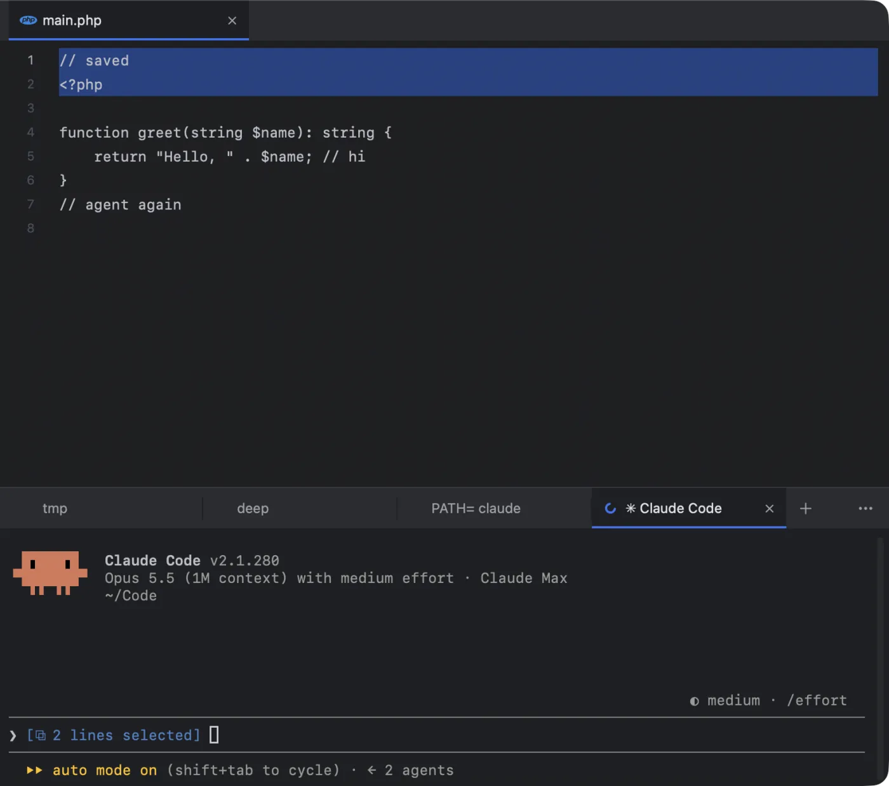
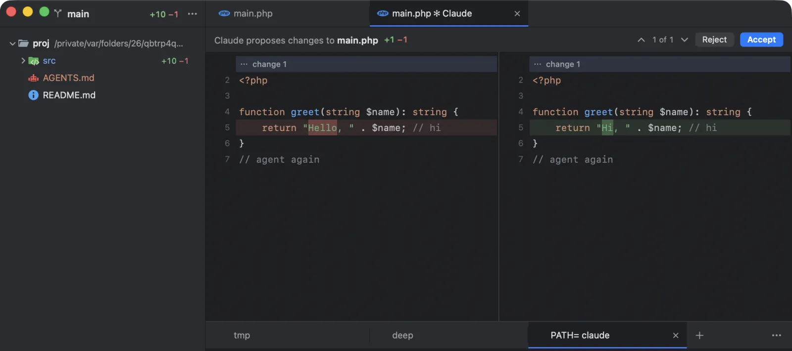

Agents in a terminal work blind: they cannot see what you are looking at, and their edits land in files you have not read yet. Next Term closes that gap. Agents that have an IDE protocol connect to Next Term as their IDE. Every agent gets **Send to Agent**, which types a reference to your selection into its prompt, and Next Term’s **MCP tools**, which let it read the editor’s selection and open files — and drive other agents.

## What each agent gets

| Agent | Tab status | IDE link: live selection, edits as diffs | MCP tools, set up for you | Send to Agent (<kbd>⌥⌘K</kbd>) |
|---|---|---|---|---|
| Claude Code | From its screen | Yes | Yes | Yes, as an @-mention |
| Gemini CLI | From its screen | Yes, with the open files | Yes | Yes |
| Qwen Code | From output timing | Yes, with the open files | Yes | Yes |
| Codex, Command Code | From its screen | — | Yes | Yes |
| Cursor Agent, opencode, Copilot CLI, Amp, Junie | From output timing | — | Yes | Yes |
| Other agents | From output timing, for the ones it recognises by name | — | Add `nxtrm mcp` yourself | Yes |

- **From its screen:** the spinner follows the agent’s own “esc to interrupt” hint, so it stops the moment the agent stops, and its permission questions turn the tab amber. The hints are checked against that agent’s own screen.
- **From output timing:** printing counts as working and 2.5 seconds of silence as done. An idle agent that keeps redrawing its screen can keep the spinner going, and a question turns the tab amber only if the agent words it the way Claude Code or Codex does, or rings the bell. Next Term reads every agent’s screen the same way, so if one of these agents shows the same hints, its tab follows them.

See [How Next Term knows](/docs/agent-status/#how-next-term-knows).

With the MCP tools, any of these agents can ask for the editor’s selection (`get_editor_selection`) and open files (`get_open_files`), and one of them can run the others. See [Orchestrate agents (MCP)](/docs/orchestration/).

## Claude Code sees your editor

There is nothing to set up. Start `claude` in a Next Term tab and it connects to Next Term as its IDE, through the protocol Claude Code uses for editors. This is verified with Claude Code 2.1.280.

- **The lines you select go with your next prompt.** Claude shows “⧉ 10 lines selected” above its input, so you can ask about “this function” without pasting it. With nothing selected, Claude knows which file you have open.
- **<kbd>⌥⌘K</kbd> puts an @-mention straight into Claude’s prompt**, such as `@app/User.php#L10-20`.
- **A `claude` started in another terminal** inside one of your open projects finds Next Term too.

## Proposed edits open as a diff

When Claude wants to change a file, its change opens in a diff tab: your file on the left, Claude’s version on the right, the changed words marked. The header reads “Claude proposes changes to `main.php`”.

- **Accept** (<kbd>⌘↩︎</kbd>): Claude writes the file.
- **Reject**: the file stays as it is.
- **Closing the tab** counts as Reject.
- **Answering in the terminal** works too, as it always has.

Next Term never writes the file itself; the agent does, after you accept. You read every change before it lands, in the same window as the agent that made it. Step through the changes in a long proposal with the arrows in the header.

## Gemini CLI and Qwen Code

Gemini CLI and Qwen Code use their own IDE companion protocol, and Next Term speaks it. Start `gemini` or `qwen` in a Next Term tab and it connects by itself.

- **What they see:** up to 10 files you have open, most recent first, and in the active one the caret position and your selection.
- **Proposed edits** open as a diff to accept or reject, as with Claude. A new proposal for the same file replaces the old one.
- **Nothing to set up.** Both CLIs connect to an editor only when their IDE mode is on. Next Term turns it on for you by setting `"ide": {"enabled": true}` in `~/.gemini/settings.json` and `~/.qwen/settings.json`. It changes only that setting and leaves the rest of the file byte for byte. It writes nothing if the agent is not installed, and never rewrites a settings file that has comments in it.

## Send to Agent (⌥⌘K)

Send to Agent hands your context to the agent in a tab, in that agent’s own syntax, and puts the cursor in its prompt so you can add the instruction.

**What you can send:**

- **Lines in the editor:** select them and press <kbd>⌥⌘K</kbd> (**Edit › Send to Agent**). With nothing selected, the whole file is sent.
- **Lines in a diff:** select them on the new side of a [side-by-side diff](/docs/diffs/#send-lines-to-your-agent) and press <kbd>⌥⌘K</kbd>. With nothing selected, the file is sent.
- **Files and folders in the sidebar:** select them and press <kbd>⌥⌘K</kbd>, or right-click and choose **Send to Agent** (“Send 3 Items to Agent” for several).
- **Text in a terminal:** select it (an error, a test’s output) and press <kbd>⌥⌘K</kbd>, or right-click and choose **Send Selection to Agent**. It goes into the agent’s prompt as a fenced block, so the agent reads it as output, not as your instruction; an agent that takes no pastes gets it on one line. Up to 200 lines (16 KB).

**Which agent receives it:** the agent in the front tab if one is running there; otherwise the agent tab you used most recently. An agent in a [remote tab](/docs/remote/) never gets it, because what it types are paths on your Mac. If no agent on your Mac is running in the window, Next Term says so, and says when the only one runs on a server.

**What it types:** a reference relative to the agent’s folder, in the agent’s own syntax.

| Agent | Lines 10–20 of a file | One line | A folder |
|---|---|---|---|
| Claude Code, opencode | `@app/User.php#L10-20` | `@app/User.php#L10` | `@app/` |
| Gemini CLI, Qwen Code, Copilot CLI | `@app/User.php (lines 10-20)` | `@app/User.php (line 10)` | `app/ (folder)` |
| Codex and every other agent | `app/User.php:10-20` | `app/User.php:10` | `app/ (folder)` |

Several items go on one line for agents that use @-mentions; for the others they become a short “Context:” list. A path with spaces is quoted. When Claude is connected through the IDE link, files go in as real @-mentions instead of typed text. A reference with a note, such as “(unsaved changes in the editor)” or “(as staged)”, is still typed: a mention carries only the file and its lines.

**Unsaved changes:** if the file has edits you have not saved, the reference says “(unsaved changes in the editor)” and the selected code is pasted after it as a fenced code block, so the agent sees what you see.

**It never presses Return.** You read what was typed, add your instruction, and send it yourself. The text arrives as a bracketed paste: code keeps its line breaks and tabs, every other control character is removed, and the text never starts with a character an agent treats as a command (`!`, `/`, `$`, `&`, `?` or `#`).

## Turning the link off

**Settings › Editor › Agents: “Agents in a tab see the editor (Claude Code, Gemini CLI, Qwen Code)”** is on by default. Turn it off and Next Term stops its IDE servers: agents no longer see your selection or open files, and proposed edits are answered in the terminal only. Send to Agent keeps working, because it only types into the prompt.

## How the link stays private

- **Local only.** The IDE servers listen on `127.0.0.1` and nowhere else.
- **A fresh secret every launch.** Each run of Next Term creates a new 256-bit token; an agent must present it, and the check runs in constant time. The lock file that tells Claude Code where to connect is readable only by you (`0600` in a `0700` folder) and is removed when Next Term quits.
- **Browsers are refused.** Requests that carry an `Origin` header, as requests from web pages do, are rejected. A website cannot reach the link, and would still need the token.
- **Agents cannot write through it.** Nothing an agent sends over the link writes a file. Next Term reports the selection and shows proposals; the agent writes only after you accept, with its own permissions.
- **Secrets are never shared.** Selections and open files from `.env` and `.env.*` (except `.env.example`), `*.pem`, `*.key`, `id_rsa`, `id_ed25519`, `.npmrc` and `.netrc` never leave the editor.

More in [Security and privacy](/docs/security-and-privacy/).

## Pick up any agent’s conversation

The Welcome window lists every conversation Claude Code, Codex and Command Code kept for a project, and resumes one in a click, in a tab in the right folder. In a project window, <kbd>⌥⌘O</kbd> does the same. See [The Welcome window and agent sessions](/docs/projects-and-git/#the-welcome-window-and-agent-sessions).

## One agent can run the others

Next Term is also an MCP server. An orchestrator agent can list every project and tab with each agent’s state, start agents in new tabs, send them prompts, wait for them, read their screens and answer their questions. It is set up for you in the agents above. See [Orchestrate agents (MCP)](/docs/orchestration/).

## Agents on your servers

A remote tab (<kbd>⌥⌘T</kbd>) runs an agent on a server you reach with ssh, kept running in tmux or herdr while your Mac sleeps, with the same marks as a local one. Agents can open and check those tabs through MCP too. See [Remote tabs on your servers](/docs/remote/).

## Coming next

Coming next **Sessions from more agents:** the conversations Gemini CLI, opencode, Copilot CLI and Cursor keep, in the Welcome window beside Claude Code’s, Codex’s and Command Code’s.

Coming later An IDE link for GitHub Copilot CLI, and remote access to the MCP server for agents outside your Mac.
