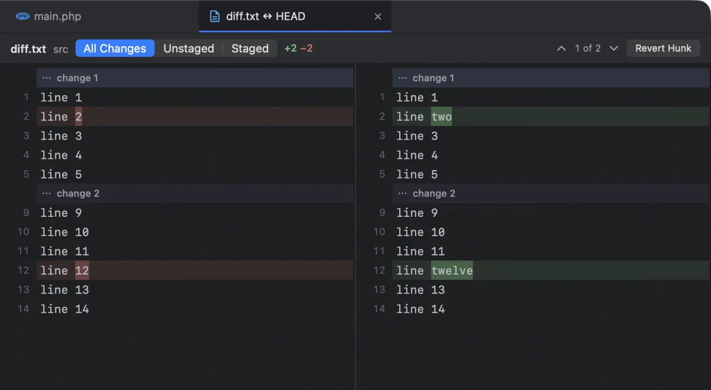

An agent just touched twelve files. Before you commit, you want to see each change the way a pull request shows it, keep the good parts and throw out the rest. **Changes side by side** does that in a tab, next to the terminal where the agent is still running.

## Open a diff

- Press <kbd>⌥⌘G</kbd> (**View › Show Changes**) to see the changes of the file you are editing.
- In the project sidebar, select a changed file and press <kbd>⌥⌘G</kbd>, or right-click it and choose **Show Changes**.

The file has to be in a git repository: changes are shown against the last commit.

## Read it

- **Old on the left, new on the right**, rows aligned so a changed line sits next to its old self.
- **Removed lines are tinted red, added lines green**, and the words that changed within a line are marked more strongly.
- **Both sides are syntax-coloured** with the editor’s grammars, and scroll together.
- The header shows the file, its folder, and the `+` and `−` line counts.
- **Step through the changes** with the arrows (“1 of 2”). Scrolling also picks the change at the top of the view, and clicking a row picks its change.
- The diff **refreshes by itself** when the file or the git index changes: an agent’s next edit, a commit, a stage.

## All changes, unstaged or staged

The switch at the top chooses what to compare:

| View | Compares | Tab title |
|---|---|---|
| All Changes | The file on disk against the last commit | `file ↔ HEAD` |
| Unstaged | The file on disk against the index | `file ↔ Index` |
| Staged | The index against the last commit | `file ↔ HEAD` |

A branch’s diffs open from the branch popup, read-only: `file @ feat/x` is what that branch changed since it parted from yours, and `file ↔ feat/x` is the file on disk against that branch. See [Compare a branch](/docs/projects-and-git/#compare-a-branch).

## Stage, unstage or revert one hunk

Act on the current change (the hunk) with the buttons on the right:

- **Stage Hunk** (in Unstaged) adds just those lines to the index, like `git add -p`.
- **Unstage Hunk** (in Staged) takes them out again.
- **Revert Hunk** (in All Changes and Unstaged) puts those lines back the way they were. Next Term asks first, and <kbd>⌘Z</kbd> undoes it.

You build a clean commit out of an agent’s work one hunk at a time, without leaving the window and without remembering `git add -p`’s keys.

## Safe while agents keep working

Agents keep editing while you review. Each hunk action first checks that the file, or the index, is exactly what the diff was made from, by its full git blob id. If anything changed in the meantime, nothing is touched: Next Term tells you, refreshes the diff, and you try again on what is really there. (Plain `git apply` would place a stale hunk at an offset instead of failing.)

Other guards:

- **Unsaved edits:** reverting a change in a file with unsaved edits in the editor is refused until you save or close it.
- **Git is busy:** if another git command holds the index lock (an agent committing, say), Next Term says so; try again in a moment.
- **Undo is careful too:** <kbd>⌘Z</kbd> after a revert restores the file only if nothing changed it since.

## Proposed edits from agents

When Claude Code, Gemini CLI or Qwen Code proposes an edit, it opens in the same kind of diff tab with **Accept** (<kbd>⌘↩︎</kbd>) and **Reject** instead of the hunk buttons. See [Proposed edits open as a diff](/docs/agents/#proposed-edits-open-as-a-diff).

## A file in a past commit

In the [Git Log](/docs/projects-and-git/#git-log), double-click a file in a commit’s changed files to see what that commit did to it, against the commit before. The tab is titled like `app.txt @ 4cc062d` and is read-only: a commit never changes, so there is nothing to stage or revert.

## Coming next

Coming soon Folding long unchanged runs, staging selected lines, and editing the proposed side of an agent’s change before you accept it.
