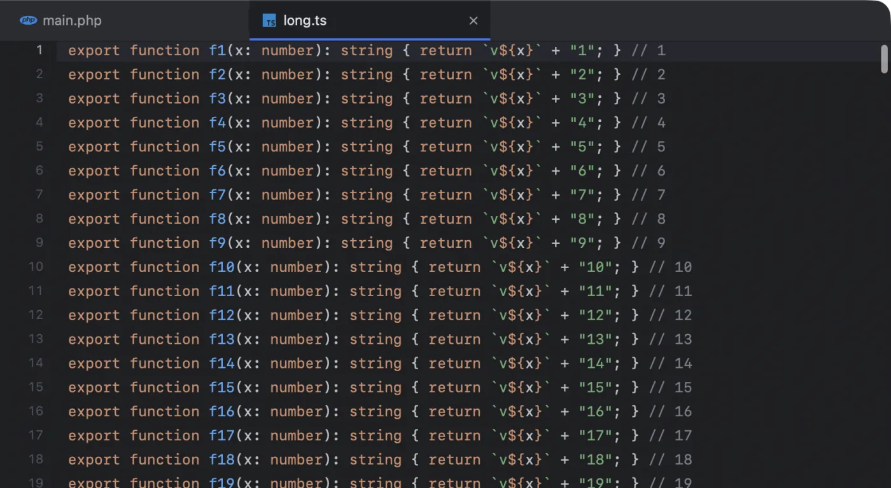

Next Term has a real code editor, not a viewer, and it sits right above the terminal where your agents work. You read what an agent changed, fix a line yourself, and save, without switching apps.

## Opening files

- **Go to File** (<kbd>⌘P</kbd>): type part of a file’s name or path and pick it. See [below](#go-to-file).
- **Double-click** a file in the project sidebar, or select it and press <kbd>⌘↓</kbd>. With **Open files with a single click** on (**Settings › Editor**), one click opens it in a [preview tab](#preview-tabs).
- **<kbd>⌘</kbd>-click a path** in terminal output, such as `src/app.ts:42:7` from a compiler, linter or agent: the file opens at that line and column (at the first line of a range such as `src/app.ts:42-48`). A Python traceback’s `File "graph.py", line 42` opens at line 42 (at the frame you clicked, when the same file appears twice), and so do pytest’s and ruff’s `path.py:42:` lines. A `graph.py:graph` reference, as `langgraph.json` writes it, opens at the definition of `graph`.
- **Pick a result** in [Find in Files](/docs/search/).
- **Run `nxtrm file:42`** in a tab or any terminal. See [The nxtrm command](/docs/command-line/).
- **Finder:** use **Open With › Next Term**, or drop a file on Next Term’s Dock icon.

Each file opens in its own tab above the terminal; a dot in place of the close button means unsaved changes. Jupyter notebooks open as notebooks, read-only (see [below](#jupyter-notebooks)). Large data files, and UTF-8 text files over 32 MB, open their first rows read-only (see [Large data files](#large-data-files)). Images and binaries open in their usual app instead. An app, a script or an executable never opens without asking first, even behind a symlink or a Finder alias (see [Security and privacy](/docs/security-and-privacy/#opening-files-and-links)).

Move between the editor and the terminal with <kbd>⌃&#96;</kbd> (**View › Focus Editor**). <kbd>⌘W</kbd> closes the file you are editing when the editor has the keyboard, and the terminal tab otherwise.

Right-click a file’s tab for **Close**, **Close Others**, **Close Tabs to the Right**, **Show in Project Sidebar**, **Copy Path**, **Copy Relative Path** (from the top of the folder the sidebar shows) and **Reveal in Finder**, for that tab’s file. Closing several asks once about the unsaved files among them: **Save**, **Cancel** or **Don’t Save**. It also asks before it closes an agent’s [proposed change](/docs/agents/#proposed-edits-open-as-a-diff), since closing one rejects it. The same commands are in the menu bar for the file in front: **File › Close Other Tabs**, **Close Tabs to the Right**, **Reveal in Finder**, **Copy Path** and **Copy Relative Path**, and **View › Show File in Project Sidebar**.

### Preview tabs

With **Open files with a single click** on (**Settings › Editor**, or the project sidebar’s ⋯ button), one click on a file in the sidebar opens it in a preview tab. Its name is in italics, and the next file you click opens in the same tab instead of a new one. The keyboard stays in the sidebar, so you can keep clicking or use the arrow keys; click in the text or press <kbd>⌃&#96;</kbd> to start typing.

A preview tab becomes an ordinary tab when you edit the file, double-click its tab or its row in the sidebar, press <kbd>⌘↓</kbd>, drag the tab, or open the file another way (<kbd>⌘P</kbd>, a path in the terminal, Find in Files). A preview never has unsaved changes, so nothing is lost when the next click replaces it.

One click opens only what the editor shows itself, up to 4 MB; large data files and SQLite databases open at any size. Folders, images, binaries, larger files, deleted files and Databases rows still open with a double-click. <kbd>⌘</kbd>-click and <kbd>⇧</kbd>-click select several files without opening any.

## Go to File

Press <kbd>⌘P</kbd> and type: a file in the project, found by name or path as you type.

- **Fuzzy:** the letters only need to appear in order, so `usrctl` finds `UserController.php`. The path counts too, so a folder name narrows the list.
- **File names first:** a match in the file’s name ranks above a match somewhere in its path.
- **At a line:** add the line number, as in `UserController.php:42`, and the file opens there.
- **From a selection:** with text selected in the editor or the terminal, <kbd>⌘P</kbd> starts with it, as Find does. Select `app/Models/User.php:42` in a stack trace and press <kbd>⌘P</kbd>, then <kbd>↩</kbd>.
- **Recently opened first:** with nothing typed, the list is the files you opened lately in the window, newest first.
- **Which files:** in a git repository, the ones git lists: tracked files, and new ones it does not ignore. A file your `.gitignore` covers, such as `.env`, is left out, except while it is among the files you opened lately in that window (from the sidebar, or a path in the terminal): the last 50, and a new window starts with none. Outside a repository, hidden folders and the usual dependency and build folders (`node_modules`, `vendor`, `build`, `dist` and the like) are left out, and a very large folder is listed only in part: up to 200,000 files, or what 5 seconds of looking finds.

## 112 grammars

Colours come from 112 open-source TextMate grammars, through shiki-swift. Most are one per language below; the rest colour code inside other code, such as Angular and Vue templates, regular expressions and prompt templates inside Python strings. Highlighting is incremental, so long files stay fast. The theme is Next Term’s own, Next Dark.

- **Web:** HTML, CSS, SCSS, Sass, Less, Stylus, PostCSS, JavaScript, TypeScript, JSX, TSX, Vue, Svelte, Astro, Angular templates, Marko, Glimmer, GraphQL, HTTP.
- **Templates:** Blade (Laravel), Twig, Liquid, Handlebars, Jinja (Django, Flask), ERB and Haml (Rails), Pug, Edge, Razor, templ, Prompty.
- **Languages:** PHP, Ruby, Python, Go, Rust, Java, Kotlin, Scala, Groovy, Swift, Objective-C, C, C++, C#, Dart, Elixir, Erlang, Haskell, OCaml, Clojure, Julia, Lua, Perl, R, Zig, CoffeeScript, PowerShell, Shell, Fish, Vim Script.
- **Data and configuration:** JSON, JSON5, JSON with Comments, JSON Lines, YAML, TOML, INI, XML, CSV, TSV, SQL, Cypher, SPARQL, Turtle, Prisma, Protocol Buffers, Terraform and HCL, Nix, dotenv, pip requirements, Dockerfile, Makefile, CMake, Just.
- **Writing and git:** Markdown, MDX, reStructuredText, Mermaid, diffs, commit and rebase messages, log files.

**Prompts read as prompts.** In RAG and agent projects (LangChain, LangGraph, LlamaIndex…), `{context}` placeholders and `{{ question }}` or `` templates inside Python strings get their own colours, as they do in `.jinja`, `.j2` and `.prompty` files. A Markdown file’s front matter (a `SKILL.md`, say) and every language in its code fences colour from the moment it opens. See [Next Term for LangChain and LangGraph](/docs/langchain-and-langgraph/).

PHP files are coloured with the grammar that also understands the HTML around `<?php … ?>`. Each grammar keeps its upstream licence; the list is in the repository’s `GRAMMARS.md`.

## Editing

| Action | How |
|---|---|
| Comment or uncomment lines, in the file’s language | <kbd>⌘/</kbd> |
| Duplicate the line, or the selection | <kbd>⌘D</kbd> |
| Delete the line | <kbd>⇧⌘K</kbd> |
| Move the line up, down | <kbd>⌃⌘↑</kbd>, <kbd>⌃⌘↓</kbd> |
| Copy, cut the whole line | <kbd>⌘C</kbd>, <kbd>⌘X</kbd> with nothing selected |
| Copy the path with the line, as `src/app.ts:42` | Right-click › **Copy Path with Line** |
| Go to a line | <kbd>⌘L</kbd> |
| Indent, outdent | <kbd>⌘]</kbd>, <kbd>⌘[</kbd>, or <kbd>⇥</kbd>, <kbd>⇧⇥</kbd> on selected lines |
| Find (from the selected name), next, previous | <kbd>⌘F</kbd>, <kbd>⌘G</kbd>, <kbd>⇧⌘G</kbd> |
| Replace in this file | <kbd>⌥⌘F</kbd> |
| Use the selection for Find | <kbd>⌘E</kbd> |
| Undo, redo | <kbd>⌘Z</kbd>, <kbd>⇧⌘Z</kbd> |
| Save, Save All | <kbd>⌘S</kbd>, <kbd>⌥⌘S</kbd> |

- **Where a name is used, without an indexer:** double-click a function, method, class or variable name to select it, then press <kbd>⌘F</kbd> to mark every use in this file (<kbd>⌘G</kbd> steps through them), or <kbd>⇧⌘F</kbd> to list every use across the project, each a click away. Both start from the selection. This is a text search, not code intelligence: it finds the name wherever it is written, comments and strings included, and it has no Go to Definition or refactoring. That keeps the editor light, and nothing indexes your project in the background.
- **Line commands** (**Edit › Line**) work on the caret’s line, or on every line the selection touches:
  - **Duplicate Line** (<kbd>⌘D</kbd>) puts a copy below and moves the caret onto it, so pressing it again makes another. A selection within one line is duplicated right after itself instead.
  - **Delete Line** (<kbd>⇧⌘K</kbd>) removes the lines with their line breaks. **Move Line Up** and **Move Line Down** (<kbd>⌃⌘↑</kbd>, <kbd>⌃⌘↓</kbd>) swap them with the line above or below, and the selection moves with them.
  - **Copy Path with Line**, also in the editor’s right-click menu, copies the file’s path from the project folder with the caret’s line, `src/app.ts:42`, or the selected lines, `src/app.ts:42-48`. A <kbd>⌘</kbd>-click in the terminal opens that, and agents read it.
  - Each is one step for <kbd>⌘Z</kbd>, which puts the caret or the selection back as it was, and each key can be changed in **Settings › Keyboard Shortcuts**. <kbd>⌘D</kbd> duplicates only while the editor has the keyboard: with the keyboard in the terminal, <kbd>⌘D</kbd> still splits it (see [Keyboard shortcuts](/docs/keyboard-shortcuts/#change-any-menu-shortcut)).
- **The whole line, with nothing selected:** <kbd>⌘C</kbd> copies the caret’s line with its line break, and <kbd>⌘X</kbd> cuts it. Pasted with nothing selected, such a line goes in whole above the caret’s line, wherever the caret is in it. Pasted over a selection, or in another app, it is ordinary text. The copy ends in a line break, so pasted at a shell prompt without bracketed paste it runs.
- **Replace** (**Edit › Find › Replace…**, <kbd>⌥⌘F</kbd>) opens the find bar with a Replace field under the search field: replace the match you are on, or every match in the file. It works in the editor only; in the terminal, a notebook or a diff the menu item is off. To replace across the project, use [Replace in Files](/docs/search/#replace) (<kbd>⇧⌘R</kbd>).
- **Auto-indent:** Return keeps the line’s indent. After an opening bracket it indents one more level, and between a pair of brackets it puts the closing one on its own line.
- **Line numbers** run down the left, and the current line is highlighted.
- **Plain text, as code needs it:** the editor never turns your quotes into curly ones.
- **Unsaved files are never closed without asking.** Quitting, closing the window, and closing the window’s last terminal tab (which closes the window too, also when its shell exits) ask whether to save them first. **Cancel** keeps the window and its tab, or puts a fresh shell in place of a tab whose shell ended with `exit` or <kbd>⌃D</kbd>.

## Line height, font size and soft wrap

- **Line height** is a multiple of the font’s own line height: **View › Line Height** offers 1.0, 1.15, 1.25, 1.35 (the default), 1.5, 1.75 and 2.0, and **Settings › Editor** has a slider in steps of 0.05. Every line gets the same height, with the text centred in it.
- **Font size** is shared with the terminal: <kbd>⌘+</kbd> bigger, <kbd>⌘-</kbd> smaller, <kbd>⌘0</kbd> back to 13 pt, anywhere from 8 to 32 pt. The font is JetBrains Mono if you have it installed, and SF Mono otherwise; **Settings › Editor › Font** chooses another monospaced font, and **Settings › Terminal › Font** the terminal’s.
- **Soft wrap** (**View › Soft Wrap**, on by default) wraps long lines at the window’s edge. A wrapped line continues under its own indentation plus two columns, so a long statement still reads as one statement at its level. Line numbers stay on each line’s first row.

## Hiding .env values

When you share your screen or record it, the editor can draw the values in your environment files as dots. Turn on **Settings › Editor › Hide values in .env files** (off by default), or use **View › Hide .env Values** for the file in front.

- **Which files:** `.env`, `.env.*` (such as `.env.local` or `.env.example`), `*.env` (such as `prod.env`) and `.flaskenv`, by the name you open them by, so a `.env` that links to a file elsewhere counts too.
- **What is hidden:** everything after the first `=` on a `KEY=value` line, quotes included, and every line of a quoted value that runs over several lines, such as a private key. Keys, comments, and a `# comment` after a value stay visible.
- **Only the drawing changes.** Copy, Find, save and undo work on the real values, and the file on disk stays as it is. Soft wrap, line numbers, blame and the change marks stay where they were.
- **Typing is not blind.** Click or type in a line and it shows its value while the caret is on it; on a private key, only that one line of it. When the editor loses the keyboard, to another window or another app such as your screen-share app, the line hides again. A file you open, or come back to, shows no values until you click or type.
- **One file:** **View › Hide .env Values** turns hiding on or off for the file in front, and has a checkmark while its values are hidden. Changing the setting applies it to every open file again.

Only the editor hides them: the terminal, side-by-side diffs and Find in Files results show the values as they are.

## Files keep their format

Saving writes the file back the way it was stored:

- **Encoding:** UTF-8, UTF-8 with a byte-order mark, and UTF-16 (little- or big-endian, with a byte-order mark) are kept as they are.
- **Line endings:** LF or CRLF are kept. A file with mixed endings keeps them exactly.
- **Permissions:** a script stays executable.
- **Links:** saving through a symlink writes the file it points at, and the link stays a link.
- **Atomic writes:** a save never leaves a half-written file behind.

## Clean-up on save

Two choices under **Settings › Editor › On save**, both off by default, change the text as you save it:

- **Trim trailing spaces** removes the spaces and tabs at the end of every line. Markdown files (`.md`, `.markdown`, `.mdx`) keep theirs, since two spaces end a line there, and so do patches (`.diff`, `.patch`), whose lines must match the files they apply to.
- **End files with a newline** adds a line break after the last line when that line has something on it, so an empty file stays empty.

Both are done in the editor just before the file is written, as one step: <kbd>⌘Z</kbd> puts the text back as you had it, and the caret stays on the text it was on. A file keeps its line endings and encoding as above.

## Files your agents change

Agents edit the files you have open. Next Term checks them about once a second:

- **A file without unsaved edits follows the agent.** Only the changed part is replaced, so your caret, the scroll position and the colours of everything else stay put.
- **A file with unsaved edits asks first.** A banner says the file changed on disk while you were editing it: **Keep My Changes** (your version is kept, and saving writes it) or **Reload from Disk**.
- **A file that was deleted or moved** shows a banner too: **Keep My Changes** or **Close**.
- **Renames and moves in the sidebar** carry open files along.

To see exactly what an agent changed, press <kbd>⌥⌘G</kbd>. See [Side-by-side diffs](/docs/diffs/).

## Jupyter notebooks

A notebook (`.ipynb`) opens as a notebook, read-only: its Markdown laid out, each code cell coloured in the kernel’s language with Jupyter’s `In [n]:` beside it, and below each cell what it showed the last time it ran.

- **Outputs:** printed text, values, tables as text, images scaled to fit, and errors in red. A long output shows its first and last lines and says how many it left out. Widgets and interactive plots, which only Jupyter can draw, are named instead.
- **Nothing runs.** Next Term has no kernel: it shows the outputs saved in the file.
- **Find** (<kbd>⌘F</kbd>) searches the whole notebook, and a selection can span cells.
- **Open as JSON**, in the notebook’s header, opens the file itself in the editor, to read or change it. A [Find in Files](/docs/search/) result in a notebook opens the JSON at its line.
- **Open With** hands the notebook to Jupyter, VS Code or another app that opens notebooks.
- **The view follows the file.** When an agent or Jupyter saves it, the new version shows, and renames and moves in the sidebar carry it along.

Notebooks up to 50 MB open this way; most of a large notebook is images and outputs, which are never laid out as text.

## Large data files

A JSON Lines (`.jsonl`, `.ndjson`), CSV or TSV file over 2 MB opens in a head view, read-only: its first 1,000 rows as a table, as quickly for a 2 GB file as for a small one. Smaller files open in the editor, with colours. So does a UTF-16 file up to 32 MB (some spreadsheet exports write one), since the head view does not read UTF-16; a larger one opens in its app. Any other UTF-8 text file over 32 MB, a log for example, opens here too instead of in another app.

- **Columns:** a JSON Lines file gets a column per top-level key, in the order the file has them, with nested values on one line. A CSV or TSV gets its header row when the first row looks like one; **First row is a header** changes that. Commas, semicolons and tabs are told apart by themselves, and a quoted field can hold commas, quotes and line breaks.
- **Bad lines** stay in their place: a line that is not JSON is marked in red with the reason, and the rest of the file still reads.
- **Table** or **Lines**, in the header, switches between the columns and each record as the file has it.
- **Load More** reads the next 1,000 rows. The footer says how many are loaded and about how many the file holds, counting its lines in the background.
- **Search** filters the loaded rows.
- **Copy As** copies the selected rows as JSON, as CSV or as the file has them; <kbd>⌘C</kbd> copies them as the file has them. <kbd>⌥⌘K</kbd> sends the file to your agent at the selected rows’ lines.
- **Open in Editor** opens the whole file in the editor, for files up to 32 MB. **Open in Default App** hands it to the app macOS uses for it.

Nothing in the head view writes to the file. When a log grows while it is open, **Load More** reads its new lines, and a last line that was still being written reads whole. A file written again from the start while it is open (by `cp` or a script, for example) is read again.

## Changes in the gutter

Beside the line numbers, a thin bar marks every line that differs from the last commit, as you type or as an agent writes, unsaved edits included:

- **Green:** an added line.
- **Blue:** a changed line.
- **A red wedge** between two lines: lines were deleted there.

Click a mark to open the file’s changes side by side. After a commit (yours or an agent’s) the marks clear on their own. Files outside git, or not committed yet, show none.

## Git blame

**View › Annotate with Git Blame** shows who last changed each line, in a column beside the line numbers. It is also on the gutter’s right-click menu, and it stays on for every file until you turn it off.

- **On the first line of each commit’s lines:** the author’s first name, how long ago in a few letters (`3d`, `2w`, `5mo`), and the short hash.
- **Shading:** the newer the commit, the brighter its lines, so recent work stands out.
- **Not committed:** lines changed since the last commit, saved or not, say so. While you type, the annotations move with your edits.
- **Hover** over a commit’s lines for its full summary, author, date and hash. **Click** to show the commit; the right-click menu also has **Show Commit** and **Copy Commit Hash**.
- **The current line:** **View › Current Line Blame** (off by default) adds a dim note after the line with the caret, such as “Ann, 3 days ago · Fix login”.

Blame is read in the background, once per file and commit, and follows a file back through renames. After a commit or a checkout it updates by itself. A file outside git shows no column, a file not committed yet is all “Not committed”, and files over 2 MB are not annotated. In a shallow clone, lines from before its oldest commit say “Earlier history”, since the clone does not know who wrote them.
