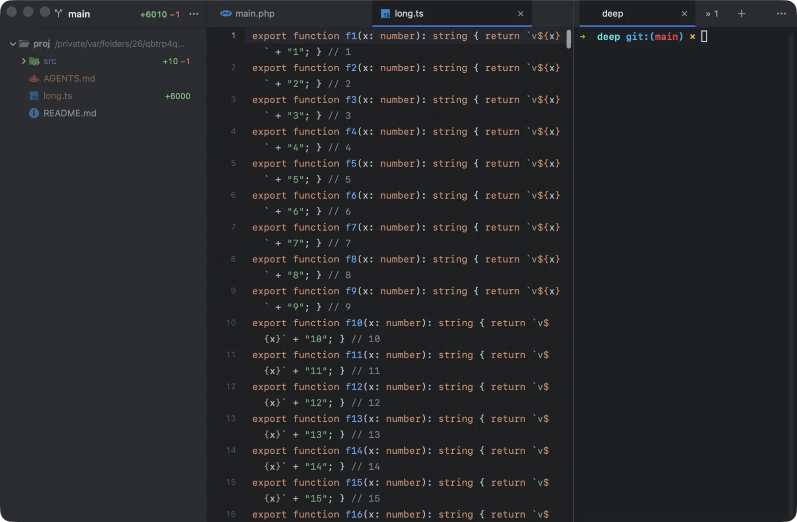

A Next Term window has three parts: the project sidebar, the editor for open files, and the terminal tabs, each of which can be split into panes. Arrange them the way you work: a wide terminal under the code, agents in a column beside it, or an agent next to its test run.

## Split panes

Any tab can hold several terminals, side by side or one above the other, as many as fit: an agent beside its test run, or two agents next to each other.

| Action | Keys |
|---|---|
| Split Right (**File** menu, or the terminal’s ⋯; in the editor <kbd>⌘D</kbd> duplicates the line) | <kbd>⌘D</kbd> |
| Split Down | <kbd>⇧⌘D</kbd> |
| Select the pane on the left, right, above or below | <kbd>⌥⌘←</kbd> <kbd>⌥⌘→</kbd> <kbd>⌥⌘↑</kbd> <kbd>⌥⌘↓</kbd> |
| Select the next or previous pane | <kbd>⌥⌘]</kbd>, <kbd>⌥⌘[</kbd> |
| Maximize the pane, and back | <kbd>⇧⌘↩︎</kbd> |
| Make Panes Equal | **Window** menu |
| Close the pane (the menu says **Close Pane**) | <kbd>⌘W</kbd> |

- **A new pane starts in the folder** of the pane you split.
- **Each pane has a header** while the tab shows more than one: the pane’s mark, its title (a pane on a server with its server mark) and a **×** that closes that pane alone. The × shows on the pane with the keyboard and on the one under the pointer. Like <kbd>⌘W</kbd> on that pane, it asks first when something runs there, or when the pane’s session is kept on a server. Middle-click a header to close its pane too.
- **Click a header** to type in that pane. **Double-click it** to rename the pane; the tab shows that name while the pane has the keyboard. An empty name goes back to the automatic one.
- **You can tell where your typing goes:** the pane with the keyboard has the header with the blue line, as the selected tab has, and the others are shaded.
- **The header takes its room from the pane,** above the terminal. It is never part of the terminal’s rows: programs in the pane see a terminal a little shorter, and nothing of the header. A tab of one pane, or a maximized pane, has no header.
- **The tab bar still shows one tab,** named after the pane with the keyboard plus how many others there are, such as “claude +2”. Its mark is the most urgent of its panes, so a pane waiting on you is never hidden.
- **Drag a divider** to resize. Panes keep their proportions when the window resizes or you split again.
- **Maximize Pane** gives one pane the whole tab while the others keep running; press it again to bring them back.
- **The tab’s ×** closes all its panes, asking once if that would stop anything. A pane goes when you close it with its × or its shell exits: its neighbour takes its room, and the keyboard if it had it. The pane you are typing in keeps the keyboard when you close another.
- **Agents can split too:** an orchestrator can open a worker in a pane beside another tab ([`new_tab` with `split_beside`](/docs/orchestration/#the-tools)). The pane you are typing in keeps the keyboard.

## Where the terminal goes

The terminal can sit **below** the editor (the default), on its **right**, on its **left**, or **above** it.

- Click the **⋯** button at the right end of the terminal’s tab bar and choose under **Move Terminal To**. The same menu splits the terminal.
- Or use **View › Terminal Position**.

The editor area appears when you open a file and hides again when the last one closes, giving the terminal the whole window.

## Where the sidebar goes

The project sidebar sits on the **left** (the default) or the **right**.

- Click the **⋯** button in the sidebar’s header, or the terminal’s **⋯**, and choose **Move Project Sidebar to the Right** (or **to the Left**).
- Or use **View › Project Sidebar on the Right**.
- Hide or show it with <kbd>⌘B</kbd>. The sidebar’s **⋯** menu has **Hide Project Sidebar** too.

## Sizes

- **Drag the line between the editor and the terminal** to share the space. The line is easy to grab: anywhere within a few points of it works. Next Term remembers the split you chose.
- **Fold the terminal away:** the arrow before the terminal’s **⋯** (or <kbd>⌘J</kbd>, **View › Collapse Terminal**, or a double-click on the empty part of the terminal’s tab bar) folds it so the editor gets the room. Below or above the editor it folds down to its tab bar. Beside the editor it folds to a slim rail at the window’s edge: the arrow back at the top, and under it each tab’s mark (the spinner while an agent works, ✓ done, ✗ failed, ! needs you). When a tab finishes, fails or needs you while folded, the rail pulses a few times and then stays still with the mark showing (with **Reduce Motion** on, the mark just appears). Click a mark to open the terminal on that tab; click anywhere else on the rail or press <kbd>⌘J</kbd> to bring it back at its size, or drag the line out to open it. Switching terminal tabs from the keyboard opens it too.
- **Resizing the window** gives the change to the editor; the terminal keeps its size.
- **Drag the sidebar’s edge** to make it wider or narrower.
- **Hide the sidebar** with the sidebar icon in its header, next to its **⋯** (or <kbd>⌘B</kbd>). While it is hidden, the same icon sits just after the window’s traffic lights; click it to bring the sidebar back. Both icons, like the fold arrow and the **+**, show their key just before them while there is room ([they follow your keys](/docs/keyboard-shortcuts/#change-any-shortcut)).
- **Full screen:** <kbd>⌃⌘F</kbd> (**View › Enter Full Screen**).

Your layout applies to every window and is remembered across launches.

## Moving around

- <kbd>⌃&#96;</kbd> moves the keyboard between the editor and the terminal (**View › Focus Editor**).
- The tab bars along the top of the window drag the window, like a title bar.
- <kbd>⌘+</kbd>, <kbd>⌘-</kbd> and <kbd>⌘0</kbd> change the font size of the terminal and the editor together.
