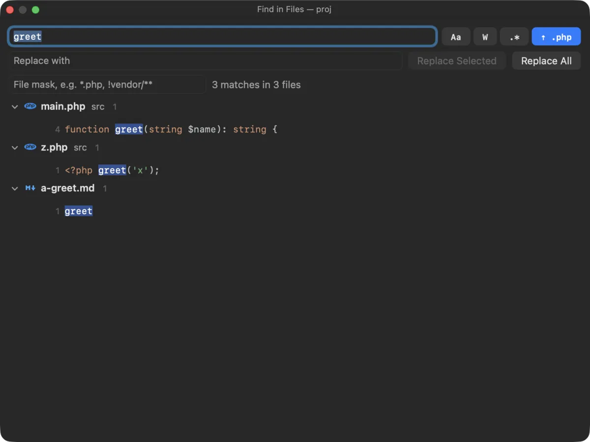

Find in Files searches the whole project as you type and lists the matches by file, coloured like the editor. Replace in Files shows what every match would become before anything is written, and never overwrites a file an agent changed since you searched.

## Search

Press <kbd>⇧⌘F</kbd> (**Edit › Find › Find in Files…**).

- **It starts from your selection**, or the word at the caret, in the editor; or from the text selected in the terminal. Double-click a function or class name and press <kbd>⇧⌘F</kbd> to see everywhere it is used: the lightweight way to find references, with no indexing.
- **Results update as you type**, grouped by file, with the line number and the line itself, the match highlighted.
- **Click a result** to open the file at that line.
- **Very large result sets** stop at 20,000 matches; narrow the search with a file mask.
- **It searches the project folder**, or what the sidebar shows when the window has no project.

The buttons next to the search field:

| Button | Does |
|---|---|
| **Aa** | Match case |
| **W** | Whole words only |
| **.\*** | Regular expression |
| **⇡ .php** | List files of the type you are editing first (on by default, remembered) |

With the type-first button on, the file you are editing comes first, then files of its type (the full compound extension first, such as `blade.php`, then `php`), then the rest.

### Which files are searched

In a git repository, the files git tracks plus untracked files that are not ignored, so `node_modules` and build output stay out of the way. Outside a repository, Next Term skips the usual dependency and build folders. Binary files, files that are not valid UTF-8 and very large files are skipped.

### File masks

Narrow the search with a comma-separated list of masks:

| Mask | Means |
|---|---|
| `*.php` | Files named `*.php`, in any folder |
| `src/**/*.ts` | TypeScript files anywhere under `src` (a mask with `/` matches the whole path; `**` spans folders) |
| `!vendor/**` | Leave out everything under `vendor` |
| `!*.min.js` | Leave out minified scripts |

A file must match one of the plain masks (if there are any) and none of the `!` masks.

## Replace

Press <kbd>⇧⌘R</kbd> (**Edit › Find › Replace in Files…**), or type in the **Replace with** field. To replace only in the file you are editing, use **Edit › Find › Replace…** (<kbd>⌥⌘F</kbd>) instead.

- **A preview of every replacement** appears in the results as you type, before anything is written. With regular expressions on, the replacement can use the captured groups as `$1`, `$2` and so on.
- **Replace Selected** replaces only the matches you selected in the results; **Replace All** asks first and gives the count (“Replace 12 matches in 4 files?”).
- **<kbd>⌘Z</kbd> undoes the whole replacement** as one step.
- Files keep their line endings and permissions (see [How files are written](/docs/security-and-privacy/#how-files-are-written)).

## Agents keep working; nothing is overwritten

Each file is read again just before it is changed. A match is replaced only if it is still on the same line with the same text. Matches on lines that you or an agent edited since the search are skipped, and Next Term tells you how many. A file saved again in the moment between that read and the write is left as it is, and named in the summary.
